# Introduction

The [Project 15 Open Platform](https://microsoft.github.io/project15/) provides a quick setup of a Internet of Things (IoT) solution technologies using Microsoft cloud technologies. Devices can be provisioned and managed trough the P15 web portal, which also displays live events and telemetry as well as with Time Series Insights and on map. It is possible to extend or adjust the Open Platform to the specific needs of a project, which is showcased here, an integration with [Edge Impulse](https://edgeimpulse.com/) tools and with the use case of [OpenCollar by SmartParks](https://opencollar.io/) in mind. 

### **Project 15 Open Platform + Edge Impulse** 


Added to the Open Platform is the integration of [Edge Impulse](https://edgeimpulse.com/). With their tools, it is easy to create TinyML models that can run on, for example, microcontrollers, which are common to use within solutions like species tracking & observation, ecosystem monitoring, pollution detection, etc, where sensor technology is used to acquire data.

> Next level for the Project 15 Open Platform is to besides collecting data also bring back intelligence to the edge 💡

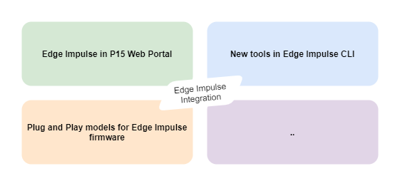

 <!-- models to the managed devices, both the process of model training with Edge Impulse and manage the deployment with P15. -->

## Outline

- Train and production scenarios
- Use case - SmartParks
- What is added to Open Platform in this version
- Guide "Edge Impulse with P15":
    - Azure deploy of Open Platform
    - Connect Edge Impulse Project
    - Set EI model to device twin
    - Edge Impulse CLI (special version):
        - Stream training Telemetry
        - Stream inference Telemetry
    - Use Plug and Play (PnP) model
- Update ML model/Firmware 
    - With serial connector
    - with BLE connect app

Scenarios covered:  
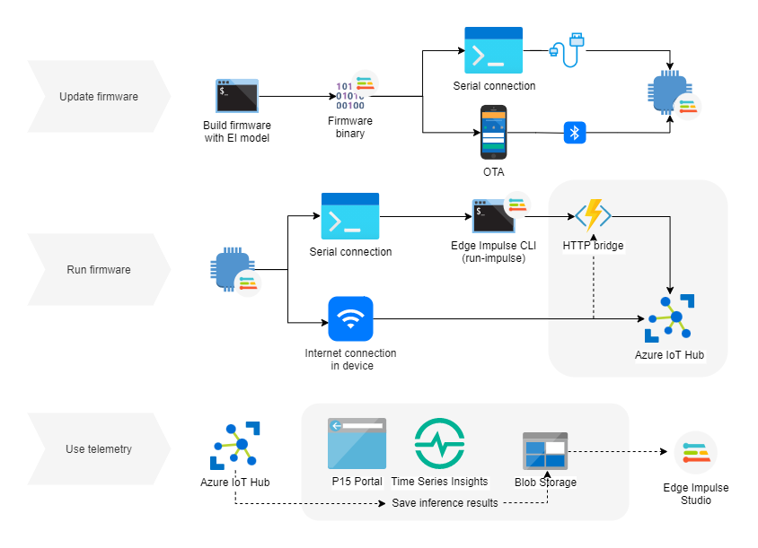

<!-- TODO: update
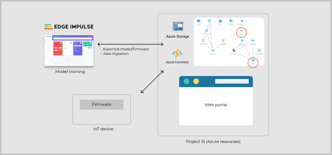 -->


## Train and production scenarios

In the process of developing and deploying a TinyML model, a common approach is to make use of two types of firmwares:
1. Firmware outputting raw data to collect training data. While this data is streaming, tooling like the [data-forwarder by Edge Impulse](https://docs.edgeimpulse.com/docs/cli-data-forwarder) can sample the data to gather sequences of data, e.g. two seconds of accelerometer data and label it.
    - firmware example: [edgeimpulse/example-dataforwarder-zephyr](https://github.com/edgeimpulse/example-dataforwarder-zephyr) 

    &nbsp;  
    
2. Firmware running inference: optimized firmware to analyze the raw data *on device* to send only events to the cloud.
    - firmware example: [edgeimpulse/firmware-nrf52840-5340-dk](https://github.com/edgeimpulse/firmware-nrf52840-5340-dk)

These two scenarios are often relevant to the same project, the data collection firmware in the development stage, and the optimized inference firmware in production mode. In the section about the custom version of Edge Impulse CLI, both scenarios will be discussed again.

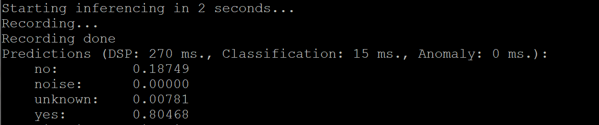

&nbsp;

## Use case - SmartParks

Edge Impulse collaborate with SmartParks, Irnas and others to analyze motion and sound data of Elephants to identify events. This adds a layer of intelligence to the existing GPS tracking and LoRaWAN connectivity of the OpenCollar.

The collar hardware is based on the device *Nordic Semi nRF52840 DK* which is also compatible with Edge Impulse see [the documentation](https://docs.edgeimpulse.com/docs/nordic-semi-nrf52840-dk). The Edge Impulse firmware for this development board is open source and hosted on GitHub: [edgeimpulse/firmware-nrf52840-5340](https://github.com/edgeimpulse/firmware-nrf52840-5340).

<!-- TODO: another image? -->


For this real use case, we identified a feedback loop that would add benefit for the OpenCollar by SmartParks to that data can be loaded back to Edge Impulse for training. Then it has to:  
    1. Be uploaded as telemetry or thorugh IoT Hub File upload from device with sensors -> enable telemetry messaging from SmartPark devices to Azure IoT Hub, in this case, integrate Azure IoT Hub to the Lora application that SmartPark uses.  
    2. Be stored until until loaded to Edge Impulse -> route telemetry from Azure IoT Hub to Azure Storage Account.  
    3. Be transformed to valid file format -> use Azure Function to fetch from Azure Storage, transform and send to Edge Impulse data ingestion.  
    4. Train model in Edge Impulse studio -> also link which Edge Impulse project belongs to a certion IoT device.

&nbsp;

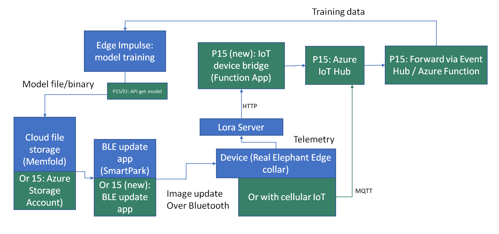
(old image, replace but keep idea about use case VS in general)

&nbsp;

## Added to P15 in the Edge Impulse integration

<!-- TODO: more to add -->
- Module in Web Portal for Edge Impulse connection and actions (UI + backend)
    - Sample project in Edge Impulse made public
- File upload to P15 IoT Hub (via Azure Function)
- Functionallity to save telemetry to Storage Account
    - Forward it to Edge Impulse (in progress)

<!-- TODO: update -->
To demonstrate how it can be adjusted to the case of adding Edge Impulse models and in particlar the use case of SmartParks and their Elephant Collar, the following changes will direct to the demo code:
- url and branch in `PrivateModelRepo`
    - integration version is at [SaraOlsson/iot-plugandplay-models](https://github.com/SaraOlsson/iot-plugandplay-models/tree/main/dtmi/edgeimpulse)
- url for *webApp* and *functions* in `git-repo`
    - webapp integration version is at [SaraOlsson/project15-openplatform-webapp](https://github.com/SaraOlsson/project15-openplatform-webapp/tree/v0.83.EI)
    - webapp function version is at [SaraOlsson/project15-openplatform-functions](https://github.com/SaraOlsson/project15-openplatform-functions/tree/v0.83.EI) 

<!-- **File upload/Telemetry (training data upload)**
- Use added function in `project15-openplatform-functions` HTTP endpoint

    - Ingest from Azure Blob Storage
    - Ingest from http POST request

This endpoint makes a POST request to `http://ingestion.edgeimpulse.com/api/training/data` -->

&nbsp;

# Guide - Integrate EI to Project 15


## Azure deploy of Open Platform (P15)

Project 15 is quickly set up in Microsoft Azure by the provided ARM template. Ajustments done is covered in the section *What is added to Open Platform in this version*

### Open ARM Template Deployment

Click **Deploy to Azure** button below. (TIP: right click the button below and select *Open link in new tab/window*) 

Then, please see remaining steps in [official deploy guide of Project 15 Open Platform](../Deploy/Deployment.md), especially note the step to runt the post deployment script.

<a href="https://portal.azure.com/#create/Microsoft.Template/uri/https%3A%2F%2Fraw.githubusercontent.com%2FSaraOlsson%2Fproject15%2Fmaster%2FEdge-Impulse-Guide%2Fazuredeploy.json" target="_blank"></a>

&nbsp;

## Connect Edge Impulse Project to P15

> Note that documentation about how to provision devices can be found at the Project 15 repository: [Connect IoT devices to the Open Platform](https://github.com/microsoft/project15/blob/master/Deploy/ConnectingDevice.md)

Training of TinyML model takes place in the Edge Impulse studio. Added to P15-EI is a widget in the web portal to connect a Edge Impulse project by entering the project API key. 

<!-- TODO: add progress status of below  -->
<!-- Choosing a model project will enable to 
- view model type and classes
- build and prepare firmware for update of IoT device -->

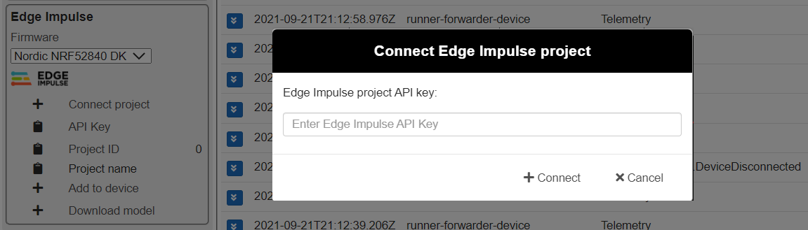

&nbsp;

## Set EI model to device twin

After being connected to an Edge Impulse project, choooe a device in the Device Selection and the *Add to device* button will be enabled. Pressing this button triggers a change in the deviceTwin tags section.

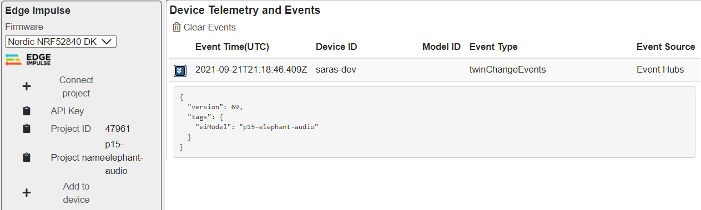

&nbsp;

## Edge Impulse CLI (special version)

Adjusted version at GitHub: [SaraOlsson/edge-impulse-cli](https://github.com/SaraOlsson/edge-impulse-cli). To use this version of the Edge Impulse CLI, please see the README of the repo.

Three tools are added to the CLI
- **edge-impulse-az-data-forwarder**
- **edge-impulse-run-impulse-az-forwarder**  
Which both forwards the data to an endpoint in the Project 15 backend.
- **edge-impulse-az-device-runner**   
Which is a sample toold on using the Azure device SDK directly

### Stream training Telemetry

1. Copy the device connection string from the P15 Portal (or directly from IoT Hub)

```edge-impulse-az-data-forwarder --az-device <your-connectionstring> --az-endpoint <your-function-url>```

<!-- edge-impulse-az-data-forwarder --az-device HostName=P15-IoTHub-hip5m.azure-devices.net;DeviceId=az-forwarder-demo;SharedAccessKey=gBtXeA3EsUFbq4mh4M0CP9oyT0ReI3t+5FDWn7ZboQw= --az-endpoint https://p15-functions-hip5m.azurewebsites.net/api/eidata?code=OcWdJRZGsQ4/rm80xfyLm1cBOruI3fhZ46sw/9B8OY/4HyiNGGqg7Q== -->

<!-- edge-impulse-az-data-forwarder --az-device HostName=P15-IoTHub-hip5m.azure-devices.net;DeviceId=az-forwarder-demo;SharedAccessKey=gBtXeA3EsUFbq4mh4M0CP9oyT0ReI3t+5FDWn7ZboQw= --az-endpoint http://localhost:7071/api/eidata --az-pnp-model dtmi:nordicsemi:eidataforward;2 -->

2. In the condig dialog, enter the device connection string.

3. Go to Edge Impulse studio (a link will be shown in the termimal). Enter a label for the data that you want to collect and press *Start sampling* 

The telemetry will be streamed also to the IoT Hub of P15 and get a PnP model attached to it. In the P15 portal, metrics from the data can be visualized if they are of type *Double* or *Long*. 

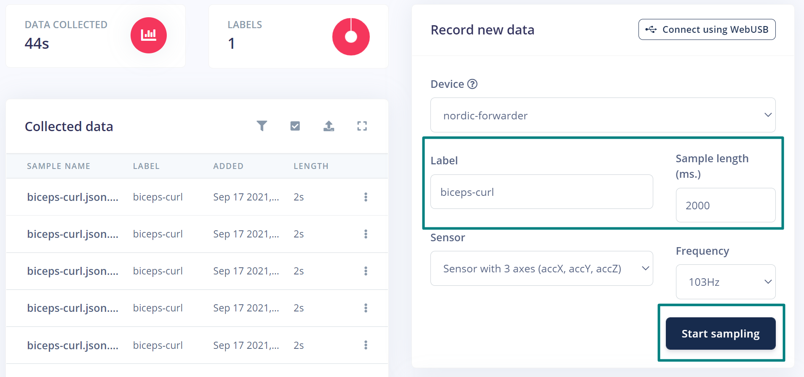
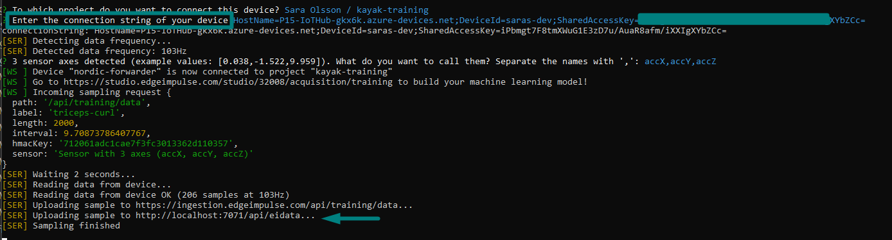

&nbsp;

### Stream inference Telemetry


The diagram below shows alternative setups of how your application might run. During development, you might just connect the device with serial connection through a USB port to try out the TinyML model. In production, either the device itself has cellular capabilities or you extend it with shields for connectivity. 

> Note: In this guide, mainly the CLI option is covered. If your devive has options to communicate directly with the cloud, you may implement Azure IoT Hub messaging directly in the firmware.

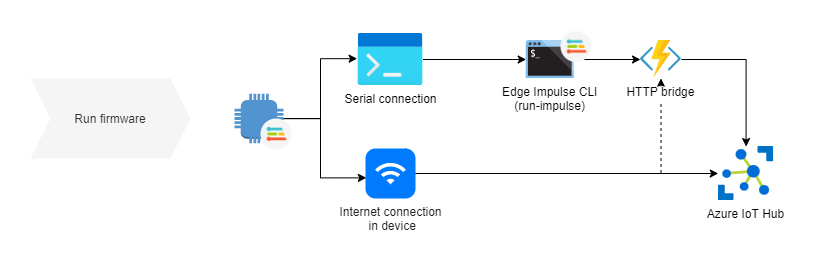

Flash inferece firmware to the device. For example, the export of the Edge Impulse pre-built firmware of the dk

```edge-impulse-run-impulse-az-forwarder --classes <class1_class2_class3> --az-device <your-connectionstring>```

<!-- 
edge-impulse-run-impulse-az-forwarder --classes no_noise_unknown_yes --az-device HostName=P15-IoTHub-gkx6k.azure-devices.net;DeviceId=runner-forwarder-device;SharedAccessKey=61+uCly4eZuEaLjdH/ynnzRHoG7RvCESczKNsydJmP4= -->

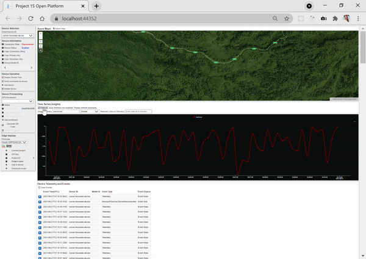

<!-- 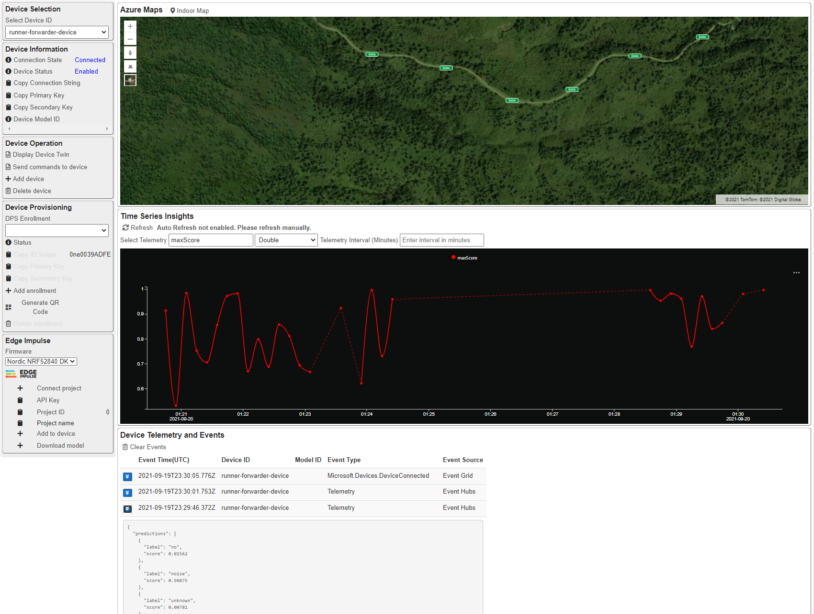 -->
*View EI runner in Project 15 Portal. Using this, it is possible to get time series insights on metrics, like the maximum score value over time. 

## Save telemetry

<!-- TODO: write about saving telemetry -->
Telemetry is saved to a Storage Account which belogs to the Project 15 resource group. The default settings is that all telemetry is forwarded there, however it can be filtered with conditions on the device metadata or telemetry content. The last connection, from Blob Storage to Edge Impulse Studio will differ depending on the data type. E.g. if the data is accelerometer data, Edge Impulse will need an array with XYZ values sampled with a specified rate. If your telemetry is separated one message per XYZ, logic to gather several messages to one sequence will be needed. If you have image data, the task is easier, etc. 

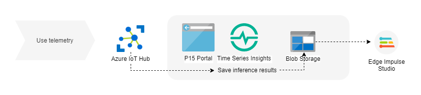

<!-- The dashed line will inform about lack of data/connectivity.* -->

&nbsp;

### Use Azure Device SDK in Edge Impulse CLI

1. Copy the device connection string from the P15 Portal (or directly from IoT Hub)

```edge-impulse-az-device-runner --az-device <your-connectionstring>```

In the example CLI tool, the device client registers to listen to a **Command** that is defined in a Plug and Play model. That is, by mixing such logic with the other CLI tools like the data-forwarder, it is possible to manage data ingestion from the P15 portal. 

&nbsp;

## Use Plug and Play (PnP) models

An IoT Plug and Play (PnP) model describes what telemetry is expected and what actions can be made from cloud to device. 

The models are found at the [SaraOlsson/iot-plugandplay-models](https://github.com/SaraOlsson/iot-plugandplay-models/blob/main/dtmi/nordicsemi/OpenCollarElephant.json) repository:

- eidataforward-1.json
- eirunnerforward-1.json

An example of how the Elephant Edge collar device is translated into a PnP model is shown by the model
- dtmi:com:smartparks:elephantcollar;1 
(change name)

In the P15 portal, the metrics in the Time Series Insights are automatically identified for PnP-enabled devices, and custom commands can be sent like the example shown below:

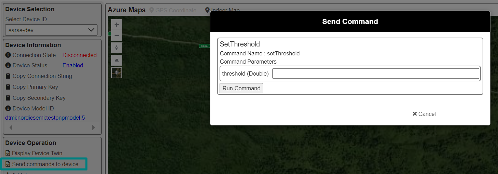


> tip: if you do not have a device, you may simulate the device and telemetry by using the [C# Plug and Play sample](https://github.com/Azure-Samples/azure-iot-samples-csharp/tree/master/iot-hub/Samples/device/PnpDeviceSamples)
 

&nbsp;

## Get Edge Impulse model 

<!-- TODO: status off Download in portal -->
<!-- (Download model from the Portal or backend) -->

Below are public made sample projects in the Edge Impulse Studio:

- [p15-elephant-audio](https://studio.edgeimpulse.com/public/47961/latest)

### Edge Impulse API

In the [Edge Impulse API](https://docs.edgeimpulse.com/reference#edge-impulse-api), we can use the [download endpoint](https://docs.edgeimpulse.com/reference#downloadbuild), where the *type* parameter implies which microcontroller the firmware is built for, or what library the model is packaged as. 

`https://studio.edgeimpulse.com/v1/api/{projectId}`

- Get your project id from Edge Impulse studio.
- Look up what *type* you need, for example: 
    - *nordic-nrf52840-dk*  
    - *zip* for C++ library  
    - *openmv* for OpenMV library 
    - *runner-linux-aarch64* for embedded Linux


&nbsp;

## Update ML model/Firmware with BLE connect app

**Flashing firmware**

First, download built firmware from Edge Impulse or as library to build your custom firmware. Then either:  
    - **A**. connect with over serial port flash the microcontroller using tools like *[west](https://docs.zephyrproject.org/latest/guides/west/build-flash-debug.html)* or by dragging binary to the disk of the microcontroller.  
    - **B**. if device has connectivity like Bluetooth it might be an option with OTA updates, which is the case in the OpenCollar devices.

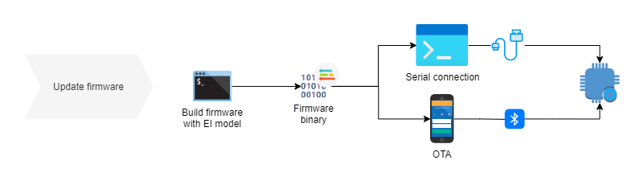


&nbsp;

# SmartParks integration details

<!-- (todo) Describe how messages where routed through Lora application to Azure IoT Hub in the Open Platform, how the telemetry can be translated into a PnP model. How the firmware is compatible with same device as Edge Impulse. How the SmartParks BLE connect app is used for DPU over the air. -->

## Usage with Lora messages

Please see the [official documentation](https://www.thethingsindustries.com/docs/integrations/cloud-integrations/azure-iot-hub/) about the Azure IoT Hub integration at The Things Network, as well as the blob post *[First look: The Things Network new Azure IoT Hub integration](https://sandervandevelde.wordpress.com/2021/09/22/first-look-the-things-network-new-azure-iot-hub-integration/)* by Sander van de Velde.

Alternatives:
- [Azure IoT Hub integration](https://www.thethingsindustries.com/docs/integrations/cloud-integrations/azure-iot-hub/) at The Things Network.  
- Use [IoT Bridge by Azure](https://github.com/Azure/iotc-device-bridge). This setup forwards Lora messages with HTTP via Azure Function to IoT Hub and might be a good option for LoRaWan solutions that run somewhere else than The Things Network.

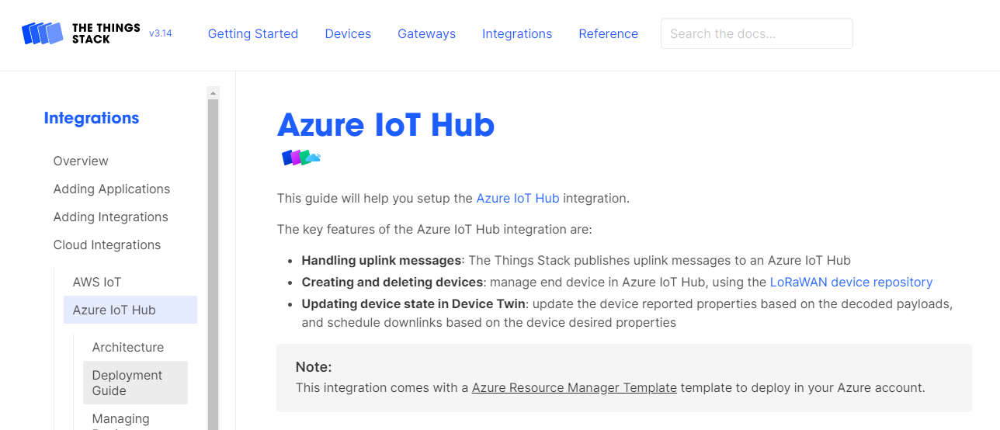

## Usage with Plug and Play models

Telemetry from SmartPark devices reach the IoT Hub of Project 15 and with a PnP model, they will be accessible in the Time Series Insights chart. Also, as shown in the image below, the latest telemetry is saved in the reported section of the device twin, (which is part of the Azure IoT Hub integration at The Things Network).

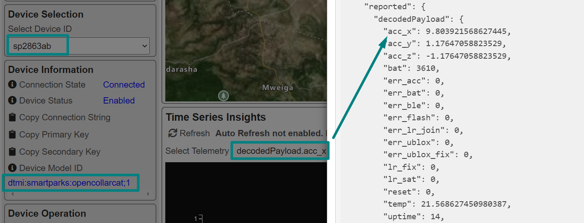


<!-- # Other/draft

### Device connectivity (move)

[Device communication protocols](https://docs.microsoft.com/en-us/azure/iot-hub/iot-hub-devguide-protocols) -->